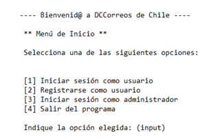
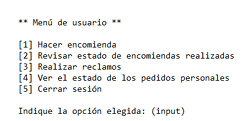
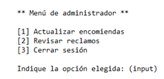

# 1. CDG Correos

Practica personal de codificación de programa DGCcorreos.

Tiempo esperado de realización: 2 semanas --> 05-07-2026

## 1.1. Pasos requeridos:

- [x] Creación de Menús
  - [x] Menú principal
  - [x] Creación Menú Usuario
  - [x] Creación Menú Administrador
- [x] Funcionalidades
  - [x] Inicio de sesión
  - [x] Creación de usuario
  - [x] Inicio sesión administrador
- [x] Menu Usuario
  - [x] Ingresar encomienda
    - [x] Solicitud de información
    - [x] Verificación de información correcta
    - [x] Carga de encomienda a archivo.csv
  - [x] Revisar estado de encomienda
  - [x] Realizar reclamo
  - [x] Ver estado de pedidos personales
  - [x] Cerrar sesión
- [ ] Menu administrador
  - [ ] Actualizar encomiendas
  - [ ] Revisar reclamos
  - [ ] Cerrar sesión

# 2. Especificos

## 2.1. Menús de usuario

Se creará un modulo que contenga unicamente los menús, sin incluir su funcionalidad esperada (por el momento)

### 2.1.1. Menú principal

> Ejemplo de menú de inicio

### 2.1.2. Menú Usuario

> Ejemplo de menú de usuario

### 2.1.3. Menú administrador

> Ejemplo de menú de administrador

## 2.2. Funcionalidades

Generaré una función que se dedique a verificar si el input escogido está dentro de las opciones.

### 2.2.1. Menu principal

La gestión de Menus se llevará a cabo a traves de un contador, el cual tendrá el siguiente formato para identificar que menú debe mostrar:

- 0: Menu principal
- 1: menu iniciar sesión
- 11: Menu de usuario | opción 1
- 12: Menu de usuario | Opción 2
- 2: Menu registrar usuario
- etc...

## 2.3. Modulo funciones.py

### 2.3.1. get_input(op)

La función recibe el mayor valor numerico y solicita un valor. Verifica que el valor se encuentre dentro del rango [1, valor]. De encontrarse en el rango, devuelve el número.

### 2.3.2. DatosUsuarios

La función recibe un diccionario y una ruta. Los valores predeterminados son un diccionario vacío y la ruta de usuarios.csv, el cual debe encontrarse en una carpeta llamada Codigo.

La función devuelve un diccionario con los datos de usuario y contraseña.

### 2.3.3. IniciarSesion

La función recibe un diccionario de usuarios con el formato [usuario] = Contraseña.

La función pide un nombre de usuario y verifica que se encuentre dentro del diccionario. Si no existe, se devuelve al menu principal.

Si el usuario existe, se le solicita la contraseña. La función da 3 intentos para ingresar correctamente.

Si falla, vuelve al menu principal. Si ingresa correctamente la contraseña, avanza al menú de usuario.

La función retorna la tupla (estado menu, usuario activo). Si falla el inicio, el retorno es (0, None), si inicia correctamente, devuelve (1, usuario_activo)

### 2.3.4. CrearUsuario

La función recibe la ruta del archivo csv y devuelve un diccionario [Usuario] = contraseña.

La función solicita un nombre de usuario y contraseña.

Si el nombre de usuario ya existe, devuelve el diccionario original.

Si el nombre no existe, confirma que el nombre tenga el minimo de caracteres permitido.

Si tiene el minimo de caracteres, solicita contraseña, el cual revisa si tiene el minimo de caracteres permitidos.

Si se cumplen todas las funciones, se actualiza el diccionario y se agrega la información al archivo usuarios.csv

### 2.3.5. InicioAdmin

La función no recibe datos.

La función solicita la contraseña de administrador. Si esta es incorrecta, consulta si quiere reintentar o volver al menú.

Si la contraseña es correcta, se avanza al siguiente menú.

## 2.4. Modulo Menu.py

Este modulo contiene la base de los imprimibles del menu Inicio, Usuario y Admin.

Además de eso, se generan algunos menús mas complejos y con funcionalidades, como las indicadas a continuación

### 2.4.1. Encomiendas

La función encomiendas pide un set de usuarios registrados. El menú indica los campos que se van a solicitar y verifica que la información entregada es correcta.

En caso de ser incorrecta y que el usuario quiera salir de la operación, la función devolverá un 0, indicando un fallo.

En caso contrario, la función actualizará el archivo de encomiendas.csv con la nueva información proporcionada y retornará 1.

### Revisar encomienda

La funcion EstadoEncomienda solicita al usuario activo en la sesión. Muestra en pantalla el nombre y el estado de sus encomiendas, y devuelve 1

### Realizar reclamo

La función RealizarReclamo solicita el usuario activo de la sesión. La función ingresa el titulo y descripción del reclamo al archivo reclamos.csv, el cual debe estar contenido en la carpeta Codigo.

La función devuelve 1.

### ActualizarEncomiendas

La función no pide un valor de entrada.

La función lee el archivo de encomiendas y genera un diccionario = [Indice] = información de encomienda.

El usuario tiene la opción de seleccionar el item del diccionario que será actualizado.

Luego de actualizar, se revisa que el estado no sea el estado final y es actualizado.

Posteriormente, se utiliza este diccionario para actualizar el archivo csv.

La función devuelve el valor 2, que es el menú de administrador en el archivo main.